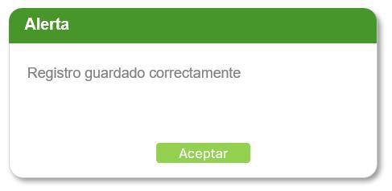
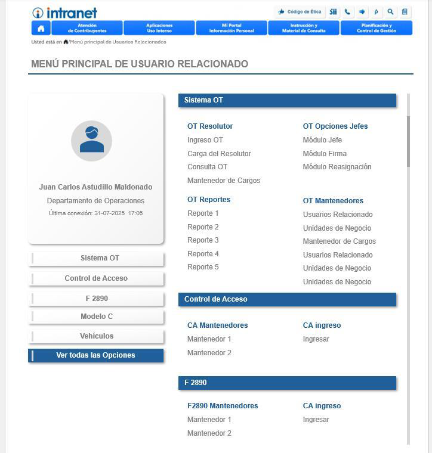
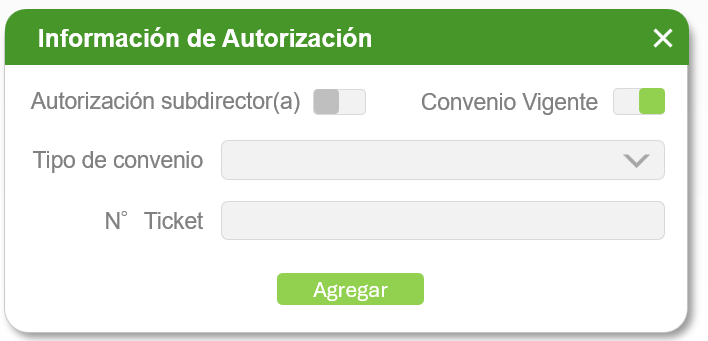

# Frontend - Módulo V: Mantenedor de Usuarios Relacionados

**Stack Tecnológico:**  
Vue 3 + Composition API | Bootstrap 5.2 | Vuex 4.1 | Axios | acaj-intra-ui

---

## 1. Análisis de Mockups (Imágenes Cliente)

| # | Imagen | Descripción Visual | Componente Identificado | Propósito Funcional |
|---|--------|-------------------|------------------------|---------------------|
| 1 |  | Header verde "Control de Acceso" con logo puerta verde izq, info usuario derecha (RUT 15000000-1, fecha 30-06-2025 10:00), navegación tabs horizontal: "Usuario relacionado" (activa), "Unidad de negocio", "Funciones", "Mantenedores" (con dropdown). Debajo: SearchBar con input "Ingrese RUT:", botón lupa, icono usuario verde, botón verde "Agregar", icono reloj historial derecha. Área contenido vacía debajo. | HeaderNav + SearchBar + EmptyState | Pantalla inicial de búsqueda de usuario por RUT. Estado sin resultados. |
| 2 |  | Modal pequeño con header verde "Alerta", body blanco con texto "Registro guardado correctamente", botón verde "Aceptar" centrado | SuccessAlert | **NOTA:** Componente estándar, NO incluir en flujos. Solo indicar mensaje específico: "Usuario creado", "Cargo eliminado", etc. |
| 3 |  | Card verde "Usuario Relacionado" con checkbox: RUT 15.000.000-0, badge "SII" azul con toggle SII/Múltiple, nombre completo "María de los Ángeles Moscoso Aldumate", email, teléfono, toggle "Simple"/"Múltiple" jurisdicción verde/gris, vigencias con calendarios, botones check verde/reload/eliminar. Debajo: sección verde expandida "Unidad SII: Departamento de Operaciones" con cargo "Jefe de Departamento" (fechas 31-12-2002 a 31-12-2025) y 4 filas verdes de funciones: "Consulta general", "Usuario", "Mantención" (2 veces), cada una con atribuciones "Alcance", "OT: Opciones 1". Segundo cargo "Tasador" con función "Mantención". | UserDetailCard + UnidadSection | Visualización completa de usuario encontrado con todos sus cargos y funciones asignadas por unidad de negocio. |
| 4 |  | Modal verde "Información de Autorización" con 2 toggles: "Autorización subdirector(a)" (OFF gris), "Convenio Vigente" (ON verde), dropdown "Tipo de convenio" con flecha, input "N° Ticket", botón verde "Agregar" | CreateAuthorizationModal | **NOTA:** Este modal pertenece a funcionalidad de AUTORIZACIÓN ESPECIAL, NO es parte del flujo estándar de creación/edición de usuarios. Agregar autorización subdirector o convenio vigente. |
| 5 |  | Pantalla completa menú intranet azul "MENÚ PRINCIPAL DE USUARIO RELACIONADO" (header azul con logo SII, navegación Atención de Contribuyentes, Aplicaciones, Mi Portal, Instrucción, Planificación). Breadcrumb "Menú principal de Usuarios Relacionados". Sidebar izquierda con foto usuario "Juan Carlos Astudillo Maldonado", Departamento de Operaciones, última conexión 31-07-2025 17:05, menú: Sistema OT, Control de Acceso (activo verde), F 2890, Modelo C, Vehículos, "Ver todas las Opciones". Panel derecho con secciones azules: Sistema OT (OT Resolutor, OT Opciones Jefes, OT Reportes 1-5, OT Mantenedores), Control de Acceso (CA Mantenedores, CA ingreso), F 2890 (F2890 Mantenedores, CA ingreso) | MainMenuView | **NOTA:** Este es el MENÚ PRINCIPAL del usuario autenticado con acceso a todos los sistemas, NO es parte del módulo V. Muestra todos los módulos asignados al usuario según sus permisos. |
| 6 |  | Header verde "Control de Acceso" con logo puerta, info usuario derecha (RUT 15000000-1, 30-08-2025 10:00). Navegación tabs: "Usuario relacionado", "Unidad de negocio", "Funciones", "Mantenedores" (dropdown expandido mostrando: Alcance, Atribuciones, Cargos, Opciones, Tipo de usuario, Grupos), "Reportes" (dropdown expandido mostrando: Tickets) | NavigationTabs | Navegación principal del sistema Control de Acceso con acceso directo a todos los mantenedores y reportes via dropdowns. |

**Notas Críticas:**

1. **Imágenes 0020 y 0022** NO son parte del flujo principal del Módulo V Mantenedor de Usuarios Relacionados:
   - image-0020: Modal de autorización especial (funcionalidad secundaria)
   - image-0022: Menú principal intranet (vista externa al módulo V)

2. **Mockups NO incluidos** (especificar según requerimientos):
   - Modal "Crear Usuario Interno/Externo" con tabs SII/OCM
   - Modal "Agregar Cargo" con dropdown cargos y funciones
   - Modal "Agregar Función" a cargo existente  
   - ConfirmDialog para eliminar usuario/cargo/función

3. **Flujo visual principal** del Módulo V:
   - Pantalla inicial: image-0027 (SearchBar vacío)
   - Usuario encontrado: image-0025 (UserDetailCard + cargos/funciones)
   - Feedback éxito: image-0028 (SuccessAlert)
   - Navegación sistema: image-0010 (NavigationTabs con dropdowns)

**Nota Crítica:** El Módulo V también requiere un modal de creación de usuario (no mostrado en imágenes 0010-0028). Según especificación en README.md, debe tener tabs para Usuario INTERNO (SII/SIGER) y Usuario EXTERNO (OCM/RIAC/Notarios).

---

## 2. Componentes Principales y Funcionalidades

### 2.1 Vista Principal: UsuariosRelacionadosView.vue

**Ruta:** `/usuarios-relacionados`

**Elementos Visuales:**
- Header superior con logo, título "Control de Acceso", info usuario autenticado
- Navegación horizontal con pestañas: Usuario relacionado (activa), Unidad de negocio, Funciones, Mantenedores (dropdown), Reportes (dropdown)
- SearchBar con input RUT + lupa + botón "Agregar"
- Área de contenido dinámica (EmptyState o UserDetailCard + UnidadSections)

---

### 2.2 SearchBar Component

**Imagen Referencia:**


**Funcionalidad:**
- Input de texto para RUT con formato automático XX.XXX.XXX-X
- Validación módulo 11 en tiempo real (dígito verificador)
- Botón lupa ejecuta búsqueda
- Botón "+ Agregar usuario nuevo" abre modal de creación
- Botón historial (reloj) muestra últimas búsquedas

**Validaciones Frontend:**
- RUT: 8-9 dígitos + DV válido (módulo 11)
- Formato: XX.XXX.XXX-X
- Obligatorio para buscar

**API Consumida:**
```
GET /acaj-ms/api/v1/{rut-autenticado}/usuarios-relacionados/buscar?rut=15000000
Response 200: {rut, dv, nombre, paterno, materno, email, telefono, tipoUsuario, jurisdiccion, vigencias, cargos[]}
Response 404: {error: "Usuario no encontrado"}
```

**Flujo:**
1. Usuario ingresa RUT
2. Sistema valida formato y módulo 11
3. Si válido: deshabilitar input, mostrar loading, ejecutar GET /buscar
4. Si 200: cargar usuario, renderizar UserDetailCard
5. Si 404: mostrar mensaje "Usuario no encontrado", mantener EmptyState
6. Si error: mostrar alerta error

---

### 2.3 EmptyState Component

**Imagen Referencia:**


**Funcionalidad:
- Estado inicial cuando no hay usuario cargado
- Mensaje: "Ingrese un RUT para buscar un usuario relacionado o haga clic en Agregar para crear uno nuevo"
- Icono ilustrativo (opcional)

---

### 2.4 UserDetailCard Component

**Imagen Referencia:**


**Funcionalidad:**
- Card con título "Usuario Relacionado" y checkbox verde
- Datos mostrados:
  - RUT con formato XX.XXX.XXX-X (campo: RELA_RUT + RELA_DV)
  - Tipo: Badge azul "SII" o naranja "Externo" (campo: RELA_TIPO_USUARIO)
  - Nombre completo (RELA_NOMBRE + RELA_PATERNO + RELA_MATERNO, límite 40 chars en RELA_NOMBRE)
  - Email (RELA_EMAIL, read-only si tipo=INTERNO)
  - Teléfono (RELA_FONO, formato +56 9 XXXX XXXX)
  - Toggle Jurisdicción: Simple / Ampliada (RELA_JURISDICCION)
  - Vigencia Inicio (obligatorio, formato DD-MM-YYYY)
  - Vigencia Fin (opcional, "Indefinido" si NULL)
- Botones acción:
  - Editar (lápiz): abre modal edición (NO implementado en imágenes, especificar comportamiento similar a crear)
  - Eliminar (basurero): abre ConfirmDialog, ejecuta DELETE

**APIs Consumidas:**
```
PUT /acaj-ms/api/v1/{rut-auth}/{rut-usuario}-{dv}/jurisdiccion
Body: {jurisdiccion: "SIMPLE" | "AMPLIADA"}
Response 200: {mensaje: "Jurisdicción actualizada"}

DELETE /acaj-ms/api/v1/{rut-auth}/{rut-usuario}-{dv}
Response 200: {mensaje: "Usuario eliminado", cargosEliminados: N, funcionesEliminadas: M}
Response 409: {error: "Usuario tiene cargos vigentes"}
```

**Flujo Toggle Jurisdicción:**

1. Usuario cambia toggle en UserDetailCard
2. Sistema muestra loading
3. Ejecuta PUT /jurisdiccion
4. Si 200: actualizar vista, mostrar alerta "Jurisdicción actualizada correctamente"
5. Si error: revertir toggle, mostrar error

**Flujo Eliminar:**

1. Usuario click basurero en UserDetailCard
2. Abrir ConfirmDialog con mensaje "¿Está seguro de eliminar este usuario?"
3. Si Aceptar: ejecutar DELETE
4. Si 200: limpiar vista, mostrar alerta "Usuario eliminado correctamente", volver a EmptyState
5. Si 409: mostrar error "Usuario tiene cargos vigentes"

---

### 2.5 UnidadSection Component

**Imagen Referencia:**


**Funcionalidad:**
- Card expandible/colapsable por cada unidad donde el usuario tiene cargos
- Header: Icono edificio + "Unidad SII: [nombre unidad]" + botón (+) agregar cargo
- Body (expandido):
  - **CargoItem:** Fila verde con "Cargo: [nombre]", badge "Vigente" (verde) o "No vigente" (gris), fechas inicio-fin, botón (+) agregar función, botón eliminar
  - **FuncionItems:** Lista de funciones bajo el cargo, con icono check, "Función: [nombre]", fecha asignación, botón eliminar

**Reglas Visuales:**
- Badge verde "Vigente" si CAUS_VIGENTE='S' y CAUS_FECHA_FIN IS NULL o > hoy
- Badge gris "No vigente" si CAUS_VIGENTE='N'
- Botón eliminar cargo: deshabilitado si cargo vigente
- Botón eliminar función: deshabilitado si es la última función del cargo

**APIs Consumidas:**
```
POST /acaj-ms/api/v1/{rut-auth}/{rut-usuario}-{dv}/cargos
Body: {codigoCargo: 5, codigoUnidad: 1025, fechaInicio: "2025-02-01", fechaFin: null}
Response 201: {id: 789, codigoCargo, descripcionCargo, ...}

DELETE /acaj-ms/api/v1/{rut-auth}/{rut-usuario}-{dv}/cargos/{cargoId}
Response 200: {mensaje: "Cargo eliminado", funcionesEliminadas: 3}
Response 409: {error: "Cargo vigente no puede eliminarse"}

POST /acaj-ms/api/v1/{rut-auth}/{rut-usuario}-{dv}/cargos/{cargoId}/funciones
Body: {codigoFuncion: 10}
Response 201: {id: 999, codigoFuncion, descripcionFuncion, fechaAsignacion}

DELETE /acaj-ms/api/v1/{rut-auth}/{rut-usuario}-{dv}/cargos/{cargoId}/funciones/{funcionId}
Response 200: {mensaje: "Función eliminada"}
Response 409: {error: "No se puede eliminar la última función"}
```

**Flujo Eliminar Cargo:**

1. Usuario click eliminar cargo
2. Validar si cargo vigente (deshabilitado si es vigente)
3. Abrir ConfirmDialog con mensaje "¿Está seguro de eliminar este cargo?"
4. Si Aceptar: DELETE /cargos/{cargoId}
5. Si 200: remover cargo de vista (CASCADE elimina funciones automáticamente), mostrar alerta "Cargo eliminado correctamente"
6. Si 409: mostrar error "Cargo vigente no puede eliminarse"

**Flujo Eliminar Función:**

1. Usuario click eliminar función
2. Validar si es la última función (deshabilitado si COUNT=1)
3. Abrir ConfirmDialog con mensaje "¿Está seguro de eliminar esta función?"
4. Si Aceptar: DELETE /cargos/{cargoId}/funciones/{funcionId}
5. Si 200: remover función de vista, mostrar alerta "Función eliminada correctamente"
6. Si 409: mostrar error "No se puede eliminar la última función"

---

### 2.6 CreateUsuarioModal Component

**Imagen Referencia:** NO MOSTRADA (especificar según README.md)

**Funcionalidad:**
- Modal grande con tabs: "Usuario Interno (SII)" | "Usuario Externo (OCM, Notarios, etc.)"
- **Tab Interno:**
  - Alerta info: "Los datos se obtendrán desde SIGER"
  - Input RUT (validación módulo 11)
  - Radio buttons: Jurisdicción Simple / Ampliada
  - DatePickers: Vigencia Inicio (obligatorio) / Vigencia Fin (opcional)
  - Dropdown: Unidad Principal (cargado dinámicamente)
  - Botón "Crear Usuario Interno"
- **Tab Externo:**
  - Similar a Interno pero:
    - Alerta info: "Los datos se obtendrán desde RIAC"
    - Vigencia Fin OBLIGATORIA (no opcional)
    - Campo adicional: Tipo Institución (OCM, Notario, CBR, CDE)

**Validaciones Frontend:**
- RUT: formato y módulo 11
- Vigencia Inicio: <= hoy
- Vigencia Fin: > Vigencia Inicio (obligatorio en tab Externo)
- Unidad Principal: obligatoria

**APIs Consumidas:**
```
POST /acaj-ms/api/v1/{rut-auth}/usuarios-relacionados/interno
Body: {rut, dv, jurisdiccion, vigenciaInicio, vigenciaFin, unidadPrincipal}
Response 201: {usuario completo con datos desde SIGER}
Response 502: {error: "Error integrando con SIGER"}

POST /acaj-ms/api/v1/{rut-auth}/usuarios-relacionados/externo
Body: {rut, dv, jurisdiccion, vigenciaInicio, vigenciaFin, unidadPrincipal}
Response 201: {usuario completo con datos desde RIAC}
Response 502: {error: "Error integrando con RIAC"}
```

**Flujo Crear Usuario Interno:**

1. Usuario completa form tab Interno
2. Validar campos obligatorios
3. Mostrar loading, ejecutar POST /interno
4. Si 201: cerrar modal, cargar usuario creado, mostrar alerta "Usuario creado correctamente"
5. Si 409: mostrar error "Usuario ya existe"
6. Si 502: mostrar error "Error al obtener datos desde SIGER"

---

### 2.7 AddCargoModal Component

**Imagen Referencia:** NO MOSTRADA en mockups cliente (especificar según requerimientos)

**Funcionalidad:**
- Modal "Agregar Cargo"
- Dropdown "Seleccione Cargo" (carga dinámica de cargos vigentes)
- DatePicker "Vigencia Inicio" (default: hoy)
- DatePicker "Vigencia Fin" (opcional, placeholder: "Indefinido")
- Sección "Funciones del cargo":
  - Lista dinámica de dropdowns "Seleccione la Función"
  - Botón (+) para agregar más dropdowns
  - Al menos 1 función obligatoria
- Botón "Agregar" (verde)

**APIs Consumidas:**
```
GET /acaj-ms/api/v1/{rut-auth}/{rut-usuario}-{dv}/cargos/disponibles
Response 200: [{codigo: 1, descripcion: "Director Regional"}, ...]
(Nota: Solo cargos con CARG_VIGENTE=1 en BD)

GET /acaj-ms/api/v1/{rut-auth}/{rut-usuario}-{dv}/cargos/{cargoId}/funciones/disponibles
Response 200: [{codigo: 10, descripcion: "Administrador Sistema"}, ...]
(Nota: Solo funciones con FUNS_VIGENTE=1 y NO asignadas al cargo)

POST /acaj-ms/api/v1/{rut-auth}/{rut-usuario}-{dv}/cargos
Body: {codigoCargo, codigoUnidad, fechaInicio, fechaFin}
Response 201: {id: 789, ...}

POST /acaj-ms/api/v1/{rut-auth}/{rut-usuario}-{dv}/cargos/{cargoId}/funciones
Body: {codigoFuncion: 10}
Response 201: {id: 999, ...}
```

**Flujo Agregar Cargo:**

1. Al abrir modal: cargar GET /cargos/disponibles
2. Usuario selecciona cargo del dropdown
3. Usuario agrega vigencias (inicio obligatorio, fin opcional)
4. Usuario selecciona al menos 1 función
5. Usuario puede agregar más funciones con botón (+)
6. Click "Agregar":
   - Validar al menos 1 función seleccionada
   - Ejecutar POST /cargos → obtener cargoId
   - Ejecutar múltiples POST /cargos/{cargoId}/funciones (Promise.all)
   - Si todos 201: cerrar modal, refrescar GET /buscar, mostrar alerta "Cargo agregado correctamente"
   - Si error: mostrar mensaje error

---

### 2.8 AddFuncionModal Component

**Imagen Referencia:** NO MOSTRADA en mockups cliente (especificar según requerimientos)

**Funcionalidad:**
- Modal "Agregar Función del cargo"
- Alerta info mostrando "Cargo: [nombre cargo]" (read-only)
- Lista dinámica de dropdowns "Seleccione la Función"
- Botón (+) para agregar más dropdowns
- Botón "Agregar"

**API Consumida:**
```
GET /acaj-ms/api/v1/{rut-auth}/{rut-usuario}-{dv}/cargos/{cargoId}/funciones/disponibles
Response 200: [{codigo: 10, descripcion: "Administrador"}, ...]

POST /acaj-ms/api/v1/{rut-auth}/{rut-usuario}-{dv}/cargos/{cargoId}/funciones
Body: {codigoFuncion: 10}
Response 201: {id: 999, ...}
```

**Flujo:**

1. Al abrir modal: cargar GET /funciones/disponibles para cargoId
2. Usuario selecciona funciones
3. Click "Agregar": ejecutar múltiples POST /funciones
4. Si todos 201: cerrar modal, refrescar, mostrar alerta "Funciones agregadas correctamente"

---

### 2.9 ConfirmDialog Component

**Imagen Referencia:** NO MOSTRADA en mockups cliente (componente estándar)

**Funcionalidad:**
- Modal pequeño con icono alerta
- Título: "Alerta"
- Mensaje: "¿Está seguro que desea eliminar este registro? Perderá toda la información asociada."
- Botón "Aceptar" (verde)
- Botón "Cancelar" (blanco)

**Uso:**
- Confirmar antes de DELETE usuario, cargo o función
- Emite evento @confirm o @cancel

---

### 2.10 SuccessAlert Component

**Imagen Referencia:** image-0028.png

**Funcionalidad:**
- Modal pequeño con fondo verde
- Título: "Alerta"
- Mensaje: "Registro guardado correctamente" (o mensaje dinámico)
- Botón "Aceptar" (cierra modal)

**Uso:**
- Feedback después de POST, PUT, DELETE exitosos

---

## 3. Mapeo Completo: Componentes → APIs → BD

| Componente | Acción Usuario | API Endpoint | Método | Response | BD Tablas |
|------------|---------------|--------------|--------|----------|-----------|
| SearchBar | Buscar usuario por RUT | `/buscar?rut={rut}` | GET | 200: Usuario / 404: No encontrado | BR_RELACIONADOS + JOINs |
| CreateUsuarioModal (Tab Interno) | Crear usuario SII | `/interno` | POST | 201: Usuario / 409: Ya existe / 502: Error SIGER | BR_RELACIONADOS |
| CreateUsuarioModal (Tab Externo) | Crear usuario externo | `/externo` | POST | 201: Usuario / 409: Ya existe / 502: Error RIAC | BR_RELACIONADOS |
| JurisdiccionToggle | Cambiar Simple ↔ Ampliada | `/{rut}-{dv}/jurisdiccion` | PUT | 200: Actualizado | RELA_JURISDICCION |
| UserDetailCard | Eliminar usuario | `/{rut}-{dv}` | DELETE | 200: Eliminado / 409: Tiene cargos vigentes | BR_RELACIONADOS (CASCADE) |
| AddCargoModal | Listar cargos vigentes | `/{rut}-{dv}/cargos/disponibles` | GET | 200: Array cargos | BR_CARGOS (CARG_VIGENTE=1) |
| AddCargoModal | Crear cargo | `/{rut}-{dv}/cargos` | POST | 201: Cargo creado | BR_CARGOS_USUARIO |
| UnidadSection (CargoItem) | Eliminar cargo | `/{rut}-{dv}/cargos/{cargoId}` | DELETE | 200: Eliminado / 409: Cargo vigente | BR_CARGOS_USUARIO (CASCADE) |
| AddFuncionModal | Listar funciones disponibles | `/{rut}-{dv}/cargos/{cargoId}/funciones/disponibles` | GET | 200: Array funciones | BR_FUNCIONES (FUNS_VIGENTE=1) |
| AddCargoModal / AddFuncionModal | Crear función | `/{rut}-{dv}/cargos/{cargoId}/funciones` | POST | 201: Función creada | BR_FUNCIONES_USUARIO |
| UnidadSection (FuncionItem) | Eliminar función | `/{rut}-{dv}/cargos/{cargoId}/funciones/{funcionId}` | DELETE | 200: Eliminado / 409: Última función | BR_FUNCIONES_USUARIO |

---

## 4. Flujos de Usuario Principales

### 4.1 Flujo: Buscar y Visualizar Usuario

1. Usuario ingresa RUT en SearchBar
2. Valida formato y módulo 11
3. Ejecuta GET /buscar
4. Si 200: Renderiza UserDetailCard + UnidadSections con cargos/funciones
5. Si 404: Muestra mensaje "Usuario no encontrado"

### 4.2 Flujo: Crear Usuario Interno (SIGER)

1. Click botón "+ Agregar usuario nuevo"
2. Abre CreateUsuarioModal, tab "Usuario Interno"
3. Completa RUT, jurisdicción, vigencias, unidad principal
4. Click "Crear Usuario Interno"
5. Ejecuta POST /interno (integración SIGER para nombre, email, teléfono)
6. Si 201: Cierra modal, carga usuario, muestra SuccessAlert
7. Si 502: Muestra error integración SIGER

### 4.3 Flujo: Asignar Cargo con Funciones

1. Desde UnidadSection, click botón (+) agregar cargo
2. Abre AddCargoModal
3. Carga GET /cargos/disponibles
4. Usuario selecciona cargo, vigencias, 1+ funciones
5. Click "Agregar"
6. Ejecuta POST /cargos → obtiene cargoId
7. Ejecuta N x POST /funciones para cada función seleccionada
8. Si todos 201: Cierra modal, refresca usuario, muestra SuccessAlert

### 4.4 Flujo: Eliminar Cargo (CASCADE funciones)

1. Usuario click eliminar cargo (solo si CAUS_VIGENTE='N')
2. Abre ConfirmDialog "¿Está seguro...?"
3. Si Aceptar: Ejecuta DELETE /cargos/{cargoId}
4. Si 200: Refresca usuario (funciones eliminadas automáticamente por CASCADE)
5. Muestra SuccessAlert

### 4.5 Flujo: Cambiar Jurisdicción

1. Usuario cambia toggle Simple ↔ Ampliada
2. Ejecuta PUT /jurisdiccion
3. Si 200: Actualiza estado local
4. Muestra mensaje éxito breve

---

## 5. Validaciones Frontend Requeridas

| Campo | Validación | Regla | Mensaje Error |
|-------|-----------|-------|---------------|
| RUT | Formato | XX.XXX.XXX-X | "Formato de RUT inválido" |
| RUT | Módulo 11 | Algoritmo dígito verificador | "Dígito verificador incorrecto" |
| RUT | Longitud | 8-9 dígitos + DV | "RUT debe tener 8 o 9 dígitos" |
| Email | Formato | Regex email estándar | "Email inválido" |
| Teléfono | Formato | +56 9 XXXX XXXX | "Formato de teléfono inválido" |
| Vigencia Inicio | Fecha | <= hoy | "Fecha inicio no puede ser futura" |
| Vigencia Fin | Fecha | > Vigencia Inicio | "Fecha fin debe ser posterior a fecha inicio" |
| Cargo | Funciones | Al menos 1 función seleccionada | "Debe seleccionar al menos una función" |
| Función | Última | No eliminar si COUNT=1 | "No se puede eliminar la última función del cargo" |

---

## 6. Integraciones Externas

| Sistema | Trigger | Datos Obtenidos | Campos BD Afectados |
|---------|---------|-----------------|---------------------|
| SIGER | POST /interno | nombres, apellidoPaterno, apellidoMaterno, email, telefonoMovil | RELA_NOMBRE, RELA_PATERNO, RELA_MATERNO, RELA_EMAIL, RELA_FONO |
| RIAC | POST /externo | nombres, apellidoPaterno, apellidoMaterno, correoElectronico, telefonoContacto, tipoInstitucion | RELA_NOMBRE, RELA_PATERNO, RELA_MATERNO, RELA_EMAIL, RELA_FONO, RELA_CODIGO |

**Nota:** Frontend NO llama directamente a SIGER/RIAC. Backend acaj-ms consume estos servicios y retorna datos completos.

---

## 7. Consideraciones Técnicas

### 7.1 Navegación
- Ruta principal: `/usuarios-relacionados`
- Modal: no cambia URL (usar v-model para visibilidad)

### 7.2 Loading States
- SearchBar: spinner en botón lupa durante GET /buscar
- Modales: deshabilitar botones y mostrar spinner durante POST
- Toggle jurisdicción: loading inline durante PUT

### 7.3 Error Handling
- 404: Mensaje específico "Usuario no encontrado"
- 409: Mensaje específico según contexto (ej: "Usuario ya existe", "Cargo vigente no puede eliminarse")
- 502: Mensaje "Error integrando con SIGER/RIAC"
- 500: Mensaje genérico "Error del servidor"

### 7.4 Feedback Visual
- SuccessAlert después de operaciones exitosas
- ConfirmDialog antes de operaciones destructivas
- Badges de estado: "Vigente" (verde), "No vigente" (gris)
- Botones deshabilitados según reglas de negocio

---

## 8. Checklist Frontend Developer

- [ ] Implementar validación RUT módulo 11 (composable reutilizable)
- [ ] Implementar SearchBar con formato automático RUT
- [ ] Crear UserDetailCard con todos los campos mapeados a BD
- [ ] Implementar UnidadSection con lógica expandir/colapsar
- [ ] Crear modales: CreateUsuarioModal (tabs), AddCargoModal, AddFuncionModal
- [ ] Implementar ConfirmDialog y SuccessAlert reutilizables
- [ ] Validar estados botones (deshabilitar eliminar si cargo vigente, función última)
- [ ] Configurar interceptor Axios para token SII (ya existe en acaj-intra-ui)
- [ ] Testing: flujos crear usuario, asignar cargo, eliminar función
