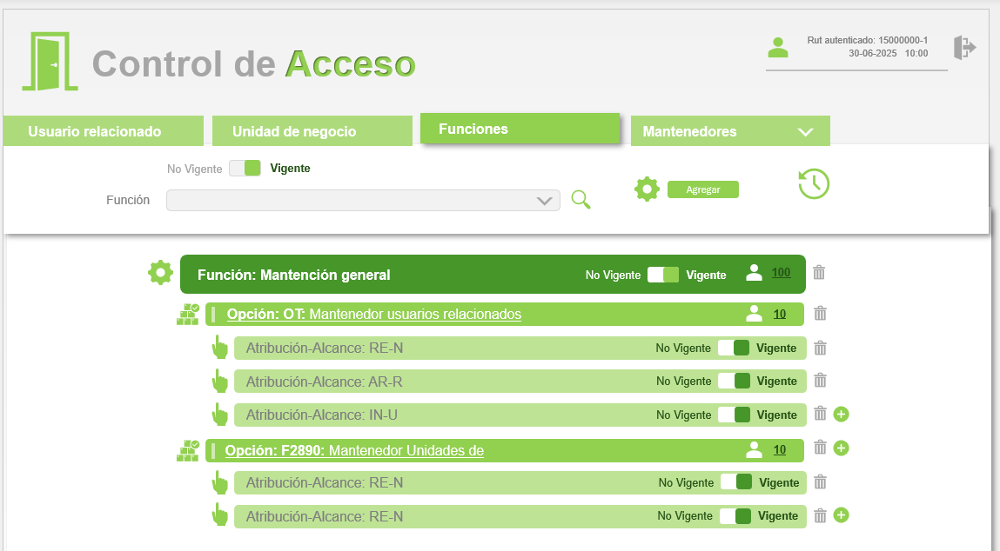
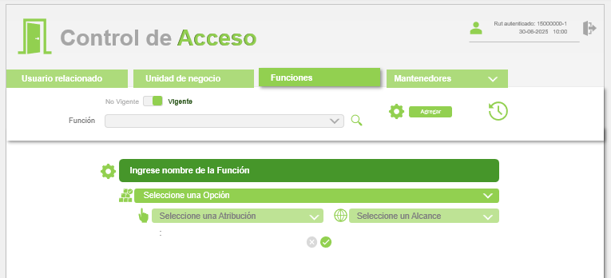
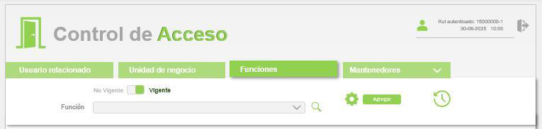

# Frontend - Módulo VII: Mantenedor de Funciones

**Stack Tecnológico:**  
Vue 3 + Composition API | Bootstrap 5.2 | Vuex 4.1 | Axios | acaj-intra-ui

---

## 1. Análisis de Mockups (Imágenes Cliente)

| # | Imagen | Descripción Visual | Componente Identificado | Propósito Funcional |
|---|--------|-------------------|------------------------|---------------------|
| 1 |  | Header verde "Control de Acceso" con logo puerta verde izquierda, info usuario derecha ("Rut autenticado: 15000000-1 | 30-06-2025 10:00"), tabs horizontales: "Usuario relacionado", "Unidad de negocio", **"Funciones" (activa en verde)**, "Mantenedores" (con dropdown). Debajo: fila blanca con toggle "No Vigente"/"Vigente" (Vigente activo en verde), label "Función", dropdown vacío, botón lupa verde, engranaje verde, botón "Agregar" verde, icono reloj verde derecha. Debajo: sección expandida verde oscuro "Función: Mantención general" con icono engranaje blanco izquierda, icono usuario blanco + "100" derecha (clickeable), toggle "No Vigente"/"Vigente" (Vigente ON verde), icono papelera gris extremo derecha. Debajo: acordeón verde claro colapsado/expandible "Opción: OT Mantenedor usuarios relacionados" con icono edificios verde izquierda, icono usuario + "10" derecha, botón (+) verde, papelera gris. Dentro del acordeón expandido: 3 filas verde claro "Atribución-Alcance: RE-N", "Atribución-Alcance: AR-R", "Atribución-Alcance: IN-U" cada una con toggle "No Vigente"/"Vigente" (todos ON), papelera gris derecha, última fila con botón (+) verde adicional. Debajo: segundo acordeón "Opción: F2890: Mantenedor Unidades de" con icono edificios, contador "10", (+) verde, papelera. Expandido muestra 2 filas "Atribución-Alcance: RE-N" (repetidas) con mismo patrón de toggles, papelera, última con (+). | HeaderNav + SearchBar + FuncionSection expandida + OpcionAccordion (colapsables) + AtribucionAlcanceItem (filas) | Pantalla principal mostrando función completa con estructura jerárquica: Función → Opciones (acordeones) → Atribuciones-Alcances (filas). Cada nivel muestra contador de usuarios clickeable. Permite gestionar vigencias y agregar nuevos elementos en cada nivel. |
| 2 |  | Header completo igual a imagen 1. SearchBar con toggle "No Vigente"/"Vigente" (Vigente ON), dropdown "Función" vacío, lupa, engranaje, botón "Agregar", reloj. Debajo: **formulario inline expandido** con fondo blanco. Primera fila verde oscuro con icono engranaje blanco izquierda, input verde "Ingrese nombre de la Función" (placeholder visible). Segunda fila verde claro con icono edificios verde izquierda, dropdown verde claro "Seleccione una Opción" (cerrado). Tercera fila verde más claro dividida en DOS columnas: izquierda con icono mano verde + dropdown "Seleccione una Atribución" (cerrado), derecha con icono mundo verde + dropdown "Seleccione un Alcance" (cerrado). Abajo: dos botones circulares icono X gris (cancelar) y check verde (guardar). | CreateFuncionForm inline | Formulario expandible inline (NO modal) para crear nueva función con primera opción, atribución y alcance en un solo paso. Se despliega al hacer clic en botón "Agregar". Similar a CreateGroupForm del módulo VIII. |
| 3 |  | Modal pequeño header verde "Alerta", body blanco "Registro guardado correctamente", botón verde "Aceptar". | SuccessAlert | **NOTA:** Componente estándar, NO incluir en flujos. Solo indicar mensaje específico en texto. |
| 4 |  | Modal header verde "Usuarios por Función" con botón X cierre blanco derecha. Dentro: fila verde claro con icono engranaje verde izquierda "Función: Usuario común web" y número "10" derecha. Tabla blanca debajo con columnas (Rut, Nombre, Vigencia Inicial, Vigencia Final), 3 registros con mismo RUT "15000000-1" y nombre "Adela Maria Lozano Arriagada" (datos repetidos son ilustrativos, en real serían usuarios distintos). Fechas: 05-08-2025 | 05-08-2026 primera fila, resto con "-" en Vigencia Final. Botón verde "Exportar a Excel" con icono Excel (X verde) abajo centro. | UserListModal | Modal para visualizar lista completa de usuarios asignados a una función específica con sus períodos de vigencia. Se abre al hacer clic en el contador de usuarios (ej: "100") de la FuncionSection. Permite exportar datos a Excel client-side. |
| 5 |  | Modal header verde "Alerta", texto "¿Está seguro que desea eliminar este registro? Perderá toda la información asociada.", botones "Aceptar" (verde) y "Cancelar" (blanco). | ConfirmDialog | **NOTA:** Componente estándar, NO incluir en flujos. Solo indicar mensaje específico de confirmación en texto. |

